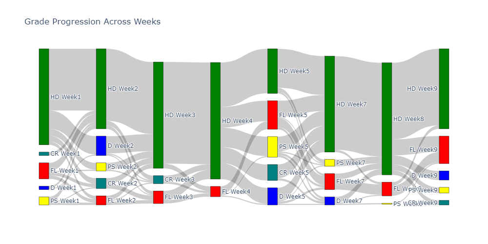

# Sankey visualisation of Moodle quiz responses

## About

This repository supports the UNSW *Teaching News You Can Use* video created by **Marion Artigaut**, School of Civil and Environmental Engineering.

This project provides .ipynb codes to visualise student responses from online quizzes (Moodle and/or Inspera) as Sankey flow diagrams from online quizzes, to help educators quickly identify:

- Ambiguous or confusing quiz questions  
- Persistent misconceptions or learning bottlenecks  
- Potential irregular answer patterns (eg. AI-assisted responses)  
- Opportunities to refine teaching and feedback  

By following the flow of responses, educators can transform raw quiz data into evidence-based insight for continuous improvement of assessment design and teaching practice.

## Prerequisites

To use the included Python notebook or scripts, you will need the following Python libraries:

- `pandas` - for data manipulation and analysis  
- `numpy` - for numerical computations  
- `matplotlib` - for static data visualization  
- `plotly` - for interactive data visualization  
- `orca` - for plotly figure saving


### Installation

You can install most required libraries using **pip**:

```bash
pip install pandas numpy matplotlib plotly
```

Orca needs to be installed using **conda** (other options available at [Orca GitHub repo](https://github.com/plotly/orca)):

```bash
conda install -c plotly plotly-orca
``` 

## Usage

The current code provides examples for:
- Moodle responses reports across multiple weeks
- Moodle STACK responses report including Error Carry Forward (ECF)

### Example output




